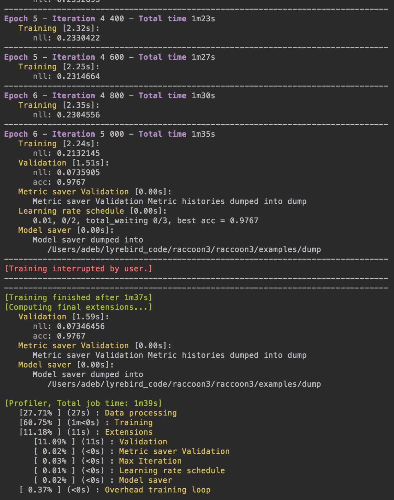

# Raccoon

Library to monitor machine learning experiments. It is not tied to any particular machine learning framework and can thus be easily integrated with Theano, Tensorflow, Pytorch or any other libraries.

Raccoon doesn't require any additional package, it only needs Python >=3.6.

